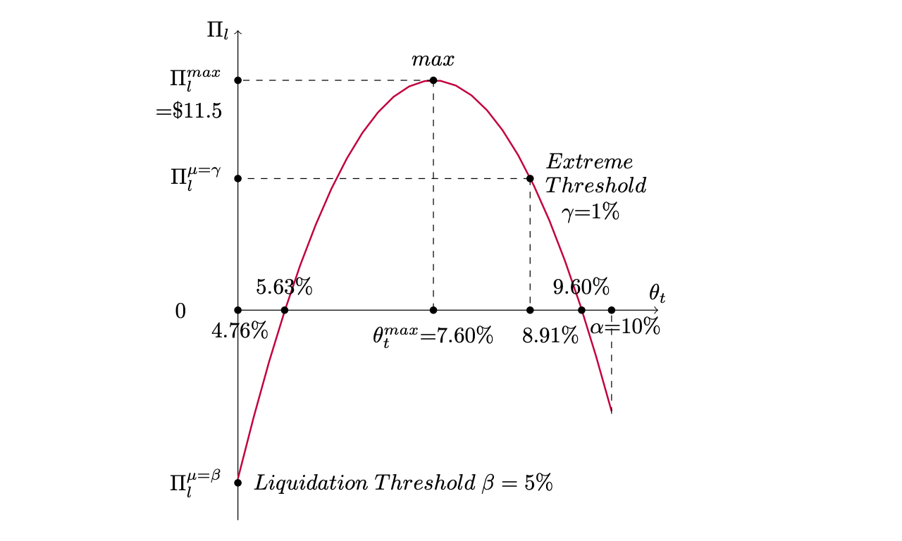

Table of Contents

<!-- TOC -->

- [Introduction](#introduction)
- [Overview](#overview)
- [Liquidity Pool](#liquidity-pool)
- [The Collateralized Synthetic Asset Protocol](#the-collateralized-synthetic-asset-protocol)
    - [Synthetic Asset Liquidity Pool](#synthetic-asset-liquidity-pool)
    - [Collateral](#collateral)
    - [Liquidation Incentive](#liquidation-incentive)
    - [fToken](#ftoken)
        - [Deposit/Mint](#depositmint)
        - [Withdraw](#withdraw)
        - [Liquidation](#liquidation)
        - [Exchange Rate](#exchange-rate)
- [The Collateralized Margin Trading Protocol](#the-collateralized-margin-trading-protocol)
    - [Margin Trading Liquidity Pool](#margin-trading-liquidity-pool)
    - [Margin Protocol](#margin-protocol)
        - [Trader's Risk Profile](#traders-risk-profile)
            - [Financing Fee - Swap](#financing-fee---swap)
            - [Equity, Margin Held, Free Margin, Margin Level](#equity-margin-held-free-margin-margin-level)
            - [Margin Call for Unsafe Traders](#margin-call-for-unsafe-traders)
            - [Stop Out for Trader Liquidation](#stop-out-for-trader-liquidation)
- [The Money Market Protocol](#the-money-market-protocol)
    - [iToken](#itoken)
    - [Interest Allocation](#interest-allocation)
        - [Interest Share](#interest-share)
            - [Allocation to Liquidity Provider](#allocation-to-liquidity-provider)
            - [Allocation to fToken depositor](#allocation-to-ftoken-depositor)
- [Implementation](#implementation)
    - [Ethereum Implementation](#ethereum-implementation)
    - [Substrate Implementation - LaminarChain](#substrate-implementation---laminarchain)
    - [Oracle Implementation](#oracle-implementation)
        - [Oracle Server](#oracle-server)
- [Building & Running LaminarChain](#building--running-laminarchain)
    - [Prerequisites](#prerequisites)
    - [Building](#building)
    - [Run](#run)
    - [Development](#development)

<!-- /TOC -->

# Introduction
Laminar aims to create an open finance platform along with financial assets to serve traders from both the crypto and mainstream finance worlds. Forex market alone has an average daily trading volume of $5 trillion, while the most active DeFi projects (mostly on Ethereum) have about $500 million of funds locked in smart contracts.

Laminar's goal is to provide people with better access to trading instruments, and introduce new, competitive business models to mainstream financial service providers. The Flow Protocols - as Laminar's flagship product - will help to solve the challenges of opaque pricing and price manipulation in the current financial markets, bridges on- and off-chain participants, and ultimately boosts on-chain trading liquidity, exposure, and variety

This document serves as a general overview of Flow protocols - generalized synthetic asset, margin trading and money market protocols, and as a brief introduction to its reference implementation on Ethereum as Smart Contracts and on Polkadot as parachain. We will add more details for developers to build on top of the protocol as it evolves further.

# Overview
Flow protocol is generalized for any type of synthetic assets and trading, the first version will focus on synthesizing EUR and JPY as crypto assets, and Forex as margin trading market, due to market demand and validation from both traders and liquidity providers.

Flow protocols have the following properties：

- **Instant Liquidity**: traders trade against smart contracts (or runtime modules in Polkadot/Substrate terms) instead of order books, hence there's instant and infinite liquidity, provided that the collateral ratio doesn't fall below the preset liquidation threshold.

- **Asset Efficiency for traders**: While all positions are over-collateralized, ***traders only need to put up collateral for the value of the positions***. The rest of the risks are taken on by the liquidity providers. In return, liquidity providers earn transaction fees, e.g. in the form of a bid and ask spread in a Forex case. Savvy liquidity providers would have initiatives to hedge their risks on- or off-chain, depending on the asset type and their risk management strategies. Margin traders will also be able to trade against the liquidity pools, that ***traders’ risks and liabilities are capped by the margin locked***, while their potential profits are also secured by the protocol.

- **Better trading experience**: Flow Protocols enable ***transparent pricing and counter-party actions*** governed by the protocol and the community while providing an excellent trading experience comparable to the off-chain services. When collateralized positions are at risk, they will be open to the public for liquidation with rewards, which ensure the soundness and safety of the liquidity pools.

- **Integrated money market**: assets deposited into the protocols both from the traders and liquidity providers will earn interest that further increases on-chain liquidity. We look to work with DeFi partners such as Compound.Finance for Ethereum implementation to enable such service via a general interface with multiple providers.

- **Tokenized positions**: Users can deposit USD stablecoins in exchange for synthetic stable fiat assets in the form of fTokens (Flow Tokens) e.g. fEUR. Traders can also tokenize margin positions connected to their short or long leveraged positions. These tokenized positions enable fluidity across asset classes, e.g. through easily tradable fTokens and margin tokens in open markets, or as building blocks of other financial services. We can't wait for programmers and the community to explore further use cases!

Below we will introduce the following protocols
- Collateralized Synthetic Asset Protocol ([draft white-paper](https://github.com/laminar-protocol/flow-protocol-whitepaper))
- Money Market Protocol ([draft white-paper](https://github.com/laminar-protocol/flow-protocol-whitepaper/blob/master/FlowMoneyMarketWhitePaperDraft_21Oct2019.pdf))
- Collateralized Margin Trading Protocol ([draft white-paper](https://github.com/laminar-protocol/flow-protocol-whitepaper/blob/master/LaminarMarginTradingWhitePaperDraft_29Jan2020.pdf))

Our protocols are under review by financial partner, do expect change and we will release update as we progress.

Refer to [the user guide wiki](https://github.com/laminar-protocol/laminar-chain/wiki) for more details.

# Liquidity Pool
A liquidity pool is set up by a liquidity provider funded with USD stablecoins as collaterals to support certain types of trading namely synthetic asset trading, or margin trading. Each pool can set up bid and ask spread for each trading pair, which is essentially the fee structure for the liquidity provider. Anyone can become a liquidity provider by setting up their own pool. An efficient market with multiple liquidity pools will trend towards competitive spread and reputable players.

Liquidity Pool Pseudo Interface
```
    function getBidSpread(address fToken) returns (unit bidSpread);
    function getAskSpread(address fToken) returns (unit askSpread);
    function depositLiquidity(FlowToken token, uint baseTokenAmount);
    function withdrawLiquidity(FlowToken token, uint flowTokenAmount);
```
Synthetic asset liquidity pool and margin trading liquidity pool would have separate implementation to support specific trading and risk management requirement.

# The Collateralized Synthetic Asset Protocol
The collateralized synthetic asset protocol allows user to mint non-USD stable-coin fToken e.g. fEUR or fJPY using USD stable-coin e.g. DAI or equivalent as collateral. There are a number of use cases for fToken
- as the basis for margin trading protocol
- as general purpose stable-coin/currency for payments
- as a sore of value where holders can deposit it into money market to earn interest

## Synthetic Asset Liquidity Pool
The synthetic asset liquidity pool voluntarily supports certain trading assets or currencies deemed as the fToken e.g. fEUR (flow ERU) as the synthetic EUR. The funds in the pool in USD stablecoin will be locked in to serve as collateral when a fToken is minted. A bid and ask spread is set up for each fToken essentially as fees to the pool. The pool can also set a higher additional collateral ratio than the `minimum additional collateral ratio` (e.g. if collateral ratio required is 150%, then additional collateral ratio is 50%) required by each fToken to provide extra layer of risk protection.

Synthetic Asset Liquidity Pool Pseudo Interface
```
    function getAdditionalCollateralRatio(fToken) returns (unit bidSpread);
    function canMint(fToken)
```

## Collateral
A position is always over-collateralized for risk management purposes. The **`additional collateral ratio`** is defined per fToken. A 10% **`additional collateral ratio`** represents 110% collateral coverage ratio meaning 110% collateral is required for the position.

To mint a new fToken (e.g. fUER), trader's deposit includes the **USD amount required** based on exchange rate, plus the **spread paid** to the liquidity provider. Both of these will be contributed to the collateral, and the remaining comes from the liquidity pool to make up a total of 110% collateral. The additional collateral is there to protect the position from exchange rate fluctuation hence stabilizing the fToken.

For example, to mint USD$1,001 worth of fEUR, with exchange rate of 1:1 for simplicity, ask spread at 0.001, **`additional collateral ratio`** as 10%, the following would happen
- user deposits USD$1,001 to exchange 1,000 fEUR where USD$1 is spread paid
- total collateral required is USD$1,100 ($1,000 * 110%)
- additional collateral from the liquidity pool would be USD$99 ($1,100 - $1,000 - $1)

Pseudo formula:
```
askPrice = exchangePrice + askSpread;
flowTokenAmount = baseTokenAmount / askPrice;
totalCollateral = flowTokenAmount * exchangePrice * ( collateralRatio + 1 );
collateralFromPool = totalCollateral - baseTokenAmount;
```

## Liquidation Incentive
The current collateral ratio is re-calculated at every deposit/withdraw action with exchange rate at the time. If the current collateral ratio is below the **`liquidation ratio`** which is defined per fToken, then the liquidity pool is open for public liquidation incentivized by a monetary reward.

A liquidator would deposit fToken back to liquidity pool hence free up partial or full collateral depending on the deposited amount therefore increase collateral ratio. Anyone can be a liquidator at this point.

This reward consists of the **spread earned** from the trade plus **a portion of the liquidity's collateral**. The incentive formula aims to reward liquidator proportionally to the risks of the pool hence minimizing probability of discounting fToken redeemable value.

There's also an **`extreme liquidation ratio`** below which all available collateral from liquidity provider plus the spread earned from the trade will will be rewarded to the liquidator as extra layer of protection.

Pseudo formula when collateral ratio is between **`liquidation ratio`** and **`extreme liquidation ratio`**.
```
reward = (liquidationRatio - currentLiquidityProviderCollateralRatio) / (liquidationRatio - extremeLiquidationRatio) * collateralFreed
```
There is a theoretical liquidation price point for making optimal profit.

- θ: Market fluctuation
- α: `additional collateral ratio`
- γ: `extreme liquidation ratio`
- β: `liquidation ratio`

## fToken
fToken (Flow Token) is non-USD stable-coin backed by selected trusted USD stable-coin.

### Deposit/Mint
Deposit USD stable-coin will mint and return fToken e.g. fEUR. The number of flow tokens minted is the amount of underlying asset being provided divided by the ask price from selected liquidity pool. For liquidity provider, the additional collateral required for a mint action is total collateral required subtract what deposited amount. For more details see the [3.2. Collateral](#32-collateral).

Pseudo Deposit function:
```
function deposit(FlowToken token, LiquidityPoolInterface pool, uint baseTokenAmount)
```

### Withdraw
The amount of underlying asset withdrawn is the number of Flow tokens multiplied by the bid price from the current exchange rate. The amount withdrawn must be less than the user's account balance, and the liquidity pool available balance.

The collateral required will be re-calculated after the withdrawn amount; if the collateral required is less than the current collateral, then the liquidity pool can be refunded after deducting the withdrawn amount from the difference between current and required collateral.

Pseudo formula:
```
baseTokenAmount = flowTokenAmount * bidPrice

if (requiredCollaterals <= collaterals) {
    collateralsToRemove = collaterals - requiredCollaterals;
    refundToPool = collateralsToRemove - withdrawnAmount;
}
```
Pseudo Withdraw function:
```
function withdraw(FlowToken token, LiquidityPoolInterface pool, uint flowTokenAmount)
```

### Liquidation
If a liquidity pool has negative liquidity i.e. current collateral is below **`liquidation threshold`**, then it is subject to liquidation by anyone to bring the collateral back to required level. When a liquidation happens, a liquidator deposits some or all minted fToken on behalf of the liquidity provider, and in return receive a reward from the outstanding collateral. If the collateral is below the **`extreme liquidation threshold`**, then additional reward is given to liquidator. For more details refer to the [3.3. Liquidation Incentive](#33-liquidation-incentive).

Pseudo Liquidation function:
```
function liquidate(FlowToken token, LiquidityPoolInterface pool, uint flowTokenAmount)
```

### Exchange Rate
The exchange rate for a Forex pair is provided by a price oracle from reputable sources like Bloomberg. Each liquidity provider has freedom to apply a spread on top of this price for its own liquidity pool to provide traders/users a bid and ask price for each Forex pair.

```
bidPrice = exchangePrice - bidSpread;
askPrice = exchangePrice + askSpread;
```

# The Collateralized Margin Trading Protocol
The collateralized margin trading protocol allows user to trade leveraged long or short Forex pairs such as EURUSD, commodities such as XAUUSD, stocks such as APPL, and cryptoassets such as BTCUSD.

There are a number of use cases for margin trading
- as a hedge against future price fluctuation e.g. an importer, who might need to pay JPY to supplier in 2 month time, can use a 10x leverage with 10% margin hedging for the full risk expecting price fluctuating within 10%
- as a profit amplifying instrument for traders to trade against price fluctuation

**How does it work?**
The protocol supports multiple liquidity pools with different trading parameters such as supported trading pairs, leverage ratios and different spreads. Traders are free to trade with any liquidity pools, and traders' risks reflected as margin levels are managed **at per liquidity pool basis**. The protocol uses USD stablecoins (as USD hereafter) as the base trading currency, for Ethereum this could be DAI, and for Polkadot this could be [aUSD (Acala Dollar)](https://acala.network/).

As a trader, after depositing some `$30,000` USD into the protocol, to long EURUSD with 10x leverage with standard lot size of 100,000 and ask price of 1.1908, the position is `$119,080`, the required margin (at 10%) would be `$11,908`. Traders are required to maintain the `Margin Level` (= Equity / Total Positions) above the `margin call threshold`, otherwise no new positions can be opened. If the `Margin Level` drops below the `Stop Out Threshold`, then all positions will be forced to close. Traders are subject to swap as margin trading involves financing credit/debit. More details are elaborated in the following sections.

As a liquidity provider, once setting up a liquidity pool, it is subject to meet risk management requirements of the protocol. The liquidity pool is required to have a certain Equity to Net Position Ratio (ENP), and Equity to Longest Leg Ratio (ELL), to ensure the pool has sufficient equity to cover all closing positions in the worse case scenario (e.g. traders closing all winning sides at once), while maximizing asset efficiency. If ENP is below the `ENP margin call threshold` e.g. 50% or ELL is below the `ELL margin call threshold` e.g. 10%, the pool will be `margin called` with restrictions of operation and monetary punishment. If ENP is below the `ENP force closure threshold` e.g. 20% or ELL is below the `ELL force closure threshold` e.g. 2%, the pool is considered insolvent and all trades will be closed with monetary penalty. More details are elaborated in the following sections.

**Why trade with this protocol?**
Essentially, a trader would have limited downside (losing all his deposit), while enjoying an upside of the entire liquidity in the pool with payout guaranteed by the protocol. Since there is no order book, trading is instant - if a trader choose to trade with a liquidity pool (e.g. long EURUSD), the pool always takes the other side of the trade (e.g. short EURUSD).

**Why provide liquidity to this protocol?**
A rational liquidity provider (in some sense no different to the brokers in the off-chain world) would hedge their risks, and taking spreads as rewards for liquidity provision. For sophisticated providers, this would be an additional revenue source complimenting their current business models - some would enjoy lower costs, more exposures, more product offerings or else. The protocol does not and cannot enforce how a liquidity provider manage their risks, however we do provide some reference risk management strategies.

Tokenization of margin positions, partial closing a margin position and other more advanced trading techniques will be added in future versions, and more details of the spec will be released as we progress.

## Margin Trading Liquidity Pool
The margin trading liquidity pool voluntarily supports certain trading pairs, leverage levels, spreads and lot size. The funds in the pool are used as collaterals for opening margin positions. Margin trading pools are required to meet a set of designated risk management criteria that are different from the synthetic asset pools.

Margin Trading Liquidity Pool Pseudo Interface
```
function depositLiquidity(poolId, amount);
function withdrawLiquidity(poolId, amount);
function isPositionAllowed(poolId, tradingPair, leverage); // check if 5x Long EURUSD is available
function getBidSpread(poolId, tradingPair);
function getAskSpread(poolId, tradingPair);
function getSwapRate(poolId, tradingPair);
function getAccumulatedSwapRate(poolId, tradingPair);
function canOpenPosition(poolId, tradingPair, leverage, amount);
```

The following two ratios are critical to judge risks of a margin trading pool:

1. Equity to Net Position Ratio (ENP)
2. Equity to Longest Leg Ratio (ELL)

**Equity to Net Position Ratio (ENP)**
`Equity` is the sum of `net deposit/withdraw`, `realized profit/loss`, `unrealized profit/loss` and `accumulated swap`. `Net Position` is the absolute value of the net value of all long and short positions within the pool. Essentially `Equity to Net Position Ratio (ENP)` gives us an aggregated risk indicator. The protocol requires each pool to have an ENP ratio higher than a certain value to avoid `margin call`.

However in practice, a liquidity pool cannot consider all of its long trades are hedged against its short trades, as closing them are up to individual traders. If the value of long and short trades are close to each other, according to the ENP requirement, only a small amount of equity is required e.g. total long positions are valued at $1,000,000, short positions are valued at $990,000, net position is only $10,000. If required ENP is 50%, then a mere $20,000 equity is required to cover near $2 million worth of trades. Therefore we introduce the second risk indicator - the Equity to Longest Leg Ratio (ELL).

**Equity to Longest Leg Ratio (ELL)**
Using the above example, the longest leg is the absolute value of total long positions valued at $1,000,000. `Equity to Longest Leg Ratio (ELL)` indicates the ability of a pool to cover for the losing side (from the pool's perspective, winning side from the traders' perspective), and the probability of the losing side would close all at once. The protocol requires each pool to have an ELL ratio higher than a certain value to avoid `margin call`. For example, if required ELL is 20%, Then $200,000 equity is required to be considered safe.

**Margin Call**
A pool is deemed risky if it reaches the `margin call` status - that is if ENP is below a certain value, or ELL is below a certain value. If a pool is being margin called, it is required to deposit further funds into the pool to bring the ENP and ELL ratios above the required levels. Otherwise no new positions can be opened, all profits of the pool from closing positions are contributed to the Laminar Treasury as penalty. As an example, if ENP is below 50% or ELL is below 20% then a margin call is triggered.

**Force Closure**
A pool is deemed insolvent if it reaches the `force closure` status - that is if ENP is below a certain value or ELL is below a certain value. If a pool is at `force closure` status, all open trades will be closed immediately, and all profits of the pool from closing these positions are contributed to the Laminar Treasury as penalty. As an example, if ELL is below 20% or ELL is below 2% then a force closure is triggered.

## Margin Protocol
The `Margin Protocol` is the management module/contract and is the main entry point for traders and liquidators. It manages all positions against all margin pools, overseas risks of individual traders and liquidity pools, and execute margin calls and liquidation on traders and pools. Traders are free to choose a liquidity pool to trade against based on their preferences, such as price, available liquidity, and risk levels etc.

Margin Protocol Pseudo Interface
```
//TODO
function openPosition(TradingPair pair, LiquidityPool pool, Leverage leverage, uint baseTokenAmount, Price price);
function closePosition(MarginTradingPair pair, uint positionId);
function getPrice(address tokenAddr);
function getAskSpread(LiquidityPool pool, address token);
function getBidSpread(LiquidityPool pool, address token);
function addTradingPair(Address pair);
function traderMarginCall(Account account)
function traderLiquidate(Account account)
function liquidityPoolMarginCall(LiquidityPool pool)
function liquidityPoolLiquidate(LiquidityPool pool)
```

**Trading Pair**
A trading pair e.g. EURUSD consists of a base currency/asset (EUR) and a quote currency/asset (USD). It indicates how much quote currency e.g. USD is needed to purchase one unit of base currency.

### Trader's Risk Profile
A trader's risk profile is established for each liquidity pool that he/she is trading in. A trader is required to deposit some funds into a pool as `initial balance` before trading. As the trader opens a position, the margin of the trade will be taken out of his/her deposited balance and locked in the protocol as `margin held`. Once the price is moved, the trader may make `unrealized profit or loss`, which would increase or decrease his/her `current equity`.

As an example, a trader deposits $30,000 into a pool, and decides to long EURUSD $100,000 with 20x leverage at bid/ask price of 1.1808/1.1908
- $5,000 ($100,000/20) is margin held
- say EUR appreciates to 1.2008/1.2108 (bid/ask price), the trader's unrealized profit is $1,000 (= 100,000 * (1.2008 - 1.1908))
- the trader's current equity becomes $31,000 (= 30,000 + 1,000)

#### Financing Fee - Swap
When we trade a currency, and hold the trade from one trading period to another (referred to as a cutoff time or rollover time), we'd either earn or pay interest for carrying the trade over that period. In **Forex and CFD** trading, the general **cutoff time is 5pm New York time**; in cryptocurrencies, the cutoff times are 4:00 UTC, 12:00 UTC and 20:00 UTC each day. If we carry our trades passing the cutoff time, we will be charged or paid interest depending on interest rates of the currencies (that's why it's also called `carry` or `carry trades`). If the interest rate of holding currency is higher than that of the borrowing currency, then the swap rate is positive meaning you will earn some interest, otherwise it will be negative and you will pay interest.

The `swap rates` are fed into the system via oracle. Each liquidity pool can set an `additional swap rate` on top (within the protocol's allowed range `MaxSwap`) to cater for variance in real-life.

**swap income/expense = value of a margin position x swap rate**

As an example, if the swap rate for long EURUSD (that is holding EUR) is -0.00009, max additional swap rate is 10%, a trader has a standard lot $100,000 long EURUSD trade, then financing fee is -$9.9 (= 100,000 x (-0.00009 x 110%)). That is the trader would need to pay an interest of $9.9 for one carry period.

#### Equity, Margin Held, Free Margin, Margin Level
`Equity` reflects the trader's ability to open further trades. It is trader's total deposits minus total withdraws reflected as `balance`, plus unrealized profit/loss and accumulated swap.

**Equity = Balance + Unrealized Profit/Loss + Accumulated Swap**

`Margin held` is the margin used and locked in opened positions.

`Free margin` is the amount can be used for opening additional positions.

**Free margin = Equity - Margin held**

`Margin level` is the key risk indicator for a trader, reflecting equity available to cover outstanding positions.
**Margin Level = Equity / Total Leveraged Positions**

#### Margin Call for Unsafe Traders
While trading with a liquidity pool, a trader is considered `unsafe` (with `margin call` status) if his/her `margin level` is equal or below the `Margin Call Threshold`. The trader is required to deposit more funds to the pool or close some existing positions until the `margin level` is above the `Margin Call Threshold`, otherwise no new positions can be open.

#### Stop Out for Trader Liquidation
If a trader's `margin level` is equal or below the `Stop Out Threshold`, then all of his/her open positions will be in `liquidation`.

In Ethereum implementation, the trader can no longer trade, and his/her trades can be closed by anyone for a liquidation fee.
In Substrate, `Off-chain Worker` is used to automate liquidation, where trades with biggest losses are closed first, until the trader is no long in `liquidation` or all positions are closed.


# The Money Market Protocol
The money market protocol serves the synthetic asset and margin trading protocols to further increase liquidity on chain. It connects to chosen money markets e.g. Compound.Finance to maximize return while guaranteeing liquidity of the asset and trading protocols. Liquidity provider would earn interest on funds in liquidity pools and collaterals. Users would earn interest on deposited fTokens. Not all the funds managed by the Money Market would earn interest, as a certain amount of cash is required to ensure liquidity for trading.

P.S. The Money Market protocol s only implemented in Ethereum.

## iToken
iToken e.g. iUSD similar to the concept of cToken in Compound.Finance, is a way to account for interest earned for the funds managed by the money market. The value of iToken increases overtime.

A liquidity pool would accept iToken as locked funds to serve as collateral. A liquidity provider would deposit USD stable-coin into the Money Market to mint iUSD and transfer the iUSDs into the liquidity pool.

When a trade happens e.g. trading USD stable-coin for fEUR, the trader's fund would convert to iUSD as collateral, while liquidity pool would transfer the remaining required iUSD into the collateral.

```
// this can be achieved in one method
function mintTo(address liquidityPoolAddress, uint baseTokenAmount)
```
The Money Market would then invest a **proportion** of the USD stable-coins that have been converted to iUSD into chosen lending platform. This proportion is calculated based on the **minimum liquidity level** set in the protocol and the utilization of funds (based on total supply and total borrowed) on the chosen lending platform. The rationale behind this is that not all money invested in lending platforms like Compound can be fully withdrawn at all times, hence we need to calculate the appropriate amount to invest to ensure certain amount of funds can be withdrawn at all times in the Flow Protocols.

```
// initial deposit of $100,000 to Money Market
minimum_liquidity_level = 40%
fund_to_money_market_0 = 100,000 // this could be initial liquidity injection from liquidity provider
proportion_to_invest_0 = (1 - minimum_liquidity_level) * TS / ( TB - (1 - minimum_liquidity_level) * fund_to_money_market_0)
                       = 85.21%                    // TS is total supply of external lending platform; TS_0 = 34,000,000;
                                                   // TB is total borrow of that platform; TB_0 = 24,000,000;
amount_invested_0 = fund_to_money_market_0 * proportion_to_invest_0 = 100,000 * 85.21%
                  = 85,213
```
Subsequent deposits into the Money Market will require rebalance to ensure the **minimum liquidity level** is maintained for ***ALL*** the funds managed in the Money Market.

```
// subsequent deposit of $200,000 to Money Market
fund_to_money_market_1 = 200,000 // this could be a new position opened
proportion_to_invest_1 = 85.93%  // TS_1 (total supply) = 34,200,000; TB_1 = 24,000,000;
                                 // TS and TB here are arbitrary; they will be obtained from external lending platform.
                                 // when supply is larger relative to amount borrowed, proportion_to_invest will be bigger
amount_invested_1 = 200,000 * 85.93% = 171,859
```
Rebalance formula: we need to calculate the ***adjustment*** required that is whether and how much we need to invest in or withdraw from the lending platform to maintain the minimum liquidity requirement for all funds managed in the Money Market. This **adjustment** is the difference between the **minimum liquidity amount**, minus the **withdraw-able amount** from lending platform, minus **current liquidity** in the protocol.

```
adjustment_1 = minimum_liquidity_level * total_fund_managed_1 - total_amount_invested_1 * withdrawable_proportion_1 - total_liquidity_1
             = 40% * (100,000 + 200,000) - (85,213 + 171,859) * 30.18% - 42,928 = -500

// If adjustment_1 > 0, then additional amount can be invested; if adjustment_1 < 0, the amount needs to be withdrawn; otherwise no action is required.

withdrawable_proportion_1 = (TS_1 + amount_invested_1 - TB_1) / (TS_1 + amount_invested_1)
                          = (34,200,000 + 171,859 - 24,000,000) / (34,200,000 + 171,859) = 30.18%
```
For more details, please refer to the white-paper.

## Interest Allocation
Interest earned from funds in the liquidity pool belongs to the liquidity provider who puts up that capital investment. This is accounted in iToken when liquidity provider withdrawing say USD from a liquidity pool.

### Interest Share
Interest earned from funds in the collateral is shared between liquidity provider and those who deposited fToken into the Money Market. **Interest share** is a way to account for capital contribution and distribution of returns.

#### Allocation to Liquidity Provider
When a new position is added, the over-collateral amount would be transferred from liquidity pool to the collateral, and an equivalent amount of interest share is minted to account for return to the liquidity provider. When the position is closed, the interest share would be burnt.

For example, if a new position of 100 USD to 99 fEUR is added, (for simplicity sake, spread is ignored in calculation), the additional collateral ratio is 10%, then $10 is required from the liquidity pool as additional collateral. Consequently 10 interest shares are minted to account for the contribution.

If this is the only fEUR position, and there's only 10 interest share issued, then liquidity provider will receive 100% (10/10) of total interest earned.

#### Allocation to fToken depositor
When a fToken holder deposits fToken to the Money Market, then an equivalent amount of interest share accounted in the underlying USD would be minted. The interest share would be burnt when fToken is withdrawn.

Following on the previous example, if a user deposits 9 fEUR (=10 USD), then 10 interest shares would be minted and accounted as the contribution of this user. At this point, liquidity provider will receive 50% (10/20 interest shares) of total interest earned, while the user will receive 50% of total interest earned.

# Implementation
We have been R&D our protocol on Ethereum, where the network is highly secure with valuable assets as basis for trading. There are also existing DeFi community and DeFi building blocks such as stablecoin. However for our target protocol participants - traders and liquidity providers, a high performance and low cost specialized trading blockchain is required to deliver the intended experience. For instance, the platform needs to be capable of handling large trading volume and frequent price fluctuations. Hence we extend our R&D to Polkadot and substrate, to develop the LaminarChain parachain.

The Ethereum implementation will be the value gateway and will leverage the DeFi ecosystem there, for example leveraging stablecoin like DAI and money markets like Compound. Meanwhile LaminarChain based on Substrate and later launched as parachain in the Polkadot ecosystem will serve as the high performance financial service and trading chain. Later the two will be integrated using Polkadot Ethereum Bridge to provide the full benefits of both worlds.

## Ethereum Implementation
See more details [here](https://github.com/laminar-protocol/flow-protocol-ethereum).

## Substrate Implementation - LaminarChain
See more details [here](https://github.com/laminar-protocol/laminar-chain/wiki)

## Oracle Implementation
We have defined the oracle interface and assume trusted oracles to provide price feed to the protocols.
```
// Pseudo Interface
    function isPriceOracle() returns (bool);
    function getPrice(SymbolId symbol) returns (uint);
```

At this stage, we have a simple Oracle design to serve our purpose for proofing the concept.

The oracle price is set by price feed administrator. We will watch closely governance standards in the oracle space, and gradually improve this. Due to sensitivity to pricing in trading use cases, two price baselines are defined to protect sudden and dramatic (potentially malicious) price fluctuation.

The difference between the new price and the last price is capped by the **`delta last limit`**. We also take a snapshot of price over a certain period. The difference between the capped new price and the snapshot price is further capped by the **`delta snapshot limit`**.

Pseudo cap function, for last price cap, `priceCap` is the **`delta last limit`**, and `lastPrice` is the Oracle last price; for snapshot price cap, `priceCap` is the **`delta snapshot limit`**, and `lastPrice` is the snapshot price.

### Oracle Server
There will be multiple Oracle servers set up to feed prices into the Oracle contract onchain. For mainnet, reputable price source like Bloomberg Forex API will be fetched to the server then feed into the Oracle contract. Monitoring services will be set up to ensure server availability and price sanity.

Note: any compromised oracle server is able to influence the price to a limited degree due to the price cap function built into the Oracle contract. A K'th largest algorithm will be able to tolerate up to K compromised servers.

Again we will continue watch closely the development in the Oracle space and open to collaboration to make it more resilient for our trading platform.

# Building & Running LaminarChain

[](https://github.com/laminar-protocol/laminar-chain/actions?workflow=Test)

## Prerequisites

Ensure you have `llvm` and `clang` installed. On Ubuntu:

```bash
apt install -y llvm clang
```

## Building

Install Rust:

```bash
curl https://sh.rustup.rs -sSf | sh
```

Make sure you have `submodule.recurse` set to true to make life with submodule easier.

```bash
git config --global submodule.recurse true
```

Install required tools and install git hooks:

```bash
make init
```

Build all native code:

```bash
make build
```

## Run

You can start a development chain with:

```bash
make run
```

## Development

To type check:

```bash
make check
```

To purge old chain data:

```bash
make purge
```

To purge old chain data and run

```bash
make restart
```

Update ORML

```bash
make update
```

__Note:__ All build command from Makefile are designed for local development purpose and hence have `SKIP_WASM_BUILD` enabled to speed up build time and use `--execution native` to only run use native execution mode.
